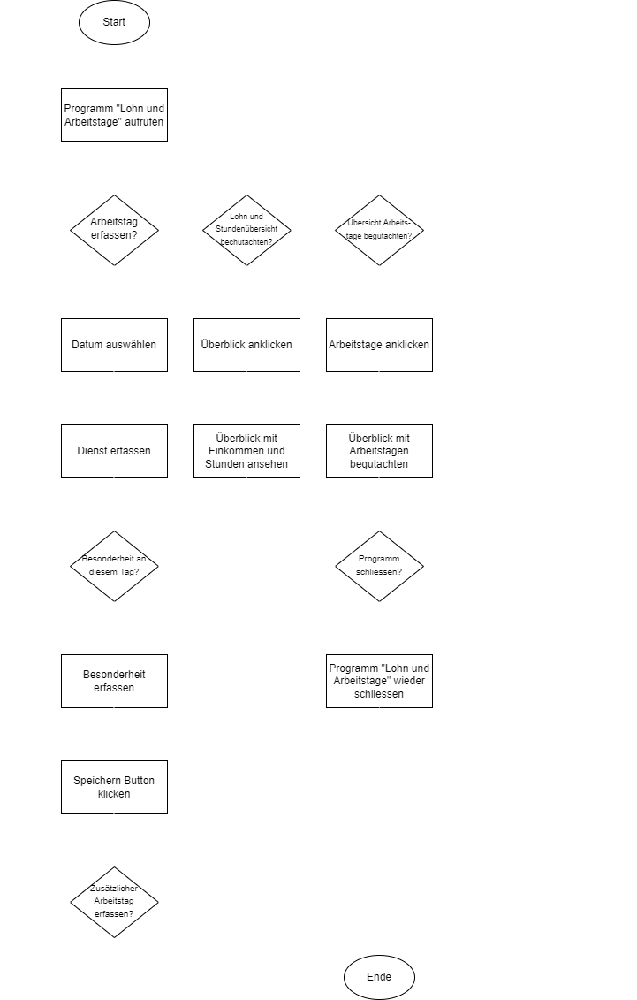

#Überblick Lohn und Arbeitstage
##1. Einleitung
Während des Studiums Digital Business Managament müssen die Studierenden zwei Module besuchen, in denen in Phyton programmiert wird. Im ersten Modul geht es darum die Grundlagen kennen zu lernen. Im zweiten sollen diese anhand eines selbst geschriebenen Programms vertieft werden. Gemäss Projektauftrag muss im Programm eine Dateneingabe, eine Berechnung und eine Datenausgabe vorhanden sein.

#2. Das Projekt
Aufgrund meines Studiums arbeite ich in einer Teilzeitanstellung bei einem lokalen Radiosender. 
Weil ich sehr unregelmässig arbeite und auf stundenbasis angestellt bin, erhalte ich Ende Monat jeweils unterschiedlich viel Lohn. 
Weil wir die Arbeitspläne aber jeweils bereits gute einen Monat vor dem Arbeitstag erhalte, kann ich in etwa ausrechnen, wie viel ich im folgenden Monat verdienen werde. 
Damit dies von nun an nicht mehr mühsam mittels Taschenrechner erledigt werden muss, übernimmt dies mein **Lohn- und Arbeitstage-Rechner**. 
Dieser wird so programmiert, dass auch Besonderheiten dieses Arbeitstags erfasst werden können. 
Das Programm liefert mir künftig also eine Übersicht über meinen Lohn, die jeweiligen Arbeitstage inkl. Dienst und bereits bekannten Besonderheiten dieses Tages. 
Dazu können zum Beispiel die Interviewgäste oder auch wichtige Pressekonferenzen gehören.

#3. Anleitung
Wird das Programm "Lohn und Arbeitstage" aufgerufen, erscheint die Startseite **Home**.
Auf dieser können direkt die Arbeitstage erfasst werden. 
Dafür müssen die beiden Pflichtfelder "Arbeitstag" (Kalender für das Datum erscheint) und der dazugehörige "Dienst" ausgewählt werden.
Das Feld "Besonderheiten" (allfällige Notzien) kann optional ausgefüllt werden. 
Anschliessend muss nur noch der Button "Speichern" angeklickt werden und die Daten werden im System hinterlegt.
Wie viele Arbeitstage maximal erfasst werden können, ist nicht definiert. 

Der User kann nun mittels Klick **Übersicht** einsehen, wie viel er im nächsten Monat verdienen wird. 
Ebenfalls ist ersichtlich, wie hoch das Einkommen aufgeteilt auf die einzelnen Dienst ist. 
Mittels Balkendiagramm wird dem User auch angezeigt, wie viele Stunden pro Dienst gearbeitet wurden. 
Aufgrund der Balken sieht man schnell, für welchen Dienst man am meisten eingeteilt ist.
Die Lohn- und Stundenübersicht können mittels Klick auf den Button "Einkommens- und Stundenübersicht ausdrucken" ausgedruckt werden. 

Des Weiteren wird dem User unter **Arbeitstage** eine Übersicht gezeigt, auf welcher sämtliche Arbeitstage inklusive Dienst aufgelistet sind. 
Allfällig eingetragene Notizen sind ebenfalls in dieser Rubrik ersichtlich. Mit einem Klick auf den Button "Liste der Arbeitstage ausdrucken" wird die Liste mit den erfassten Arbeitstagen ausgedruckt.

#4. Flow Diagramm
Was in _Punkt 3 Anleitung_ visualisiert wurde, wird nun zustäzlich im folgenden Flow Diagramm dargestellt.

#5. Notwendige Module
Damit das Programm funktioniert, müssen folgende Module ins Pycharm importiert werden:

- Flask (als Webframework)
- Plotly (für das Diagramm)
- Json (für die Datenspeicherung)

#6. Reflexion der Funktionen
Gemäss Projektauftrag, muss das zu programmierende System eine Dateneingabe, eine Berechung mit diesen Daten und eine anschliessende Ausgabe dieser berechneten Daten enthalten.
Im programmierten Lohn- und Arbeitstage-Recher , werden diese Voraussetzungen wie folgt erfüllt:

Auf der Homeseite werden die Daten eingegeben. 
Anschlissend werden die im System zu den jeweiligen Diensten hinterlegten Stunden berechnet. 
Diese werden dann wiederum unter Überblick insgesamt und aufgeteilt auf die einzelnen Dienste ausgegeben. 
Ebenfalls kann unter Arbeitstage eine vollständige Übersicht der eingegebenen Daten begutachtet werden. 
